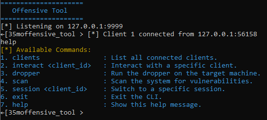
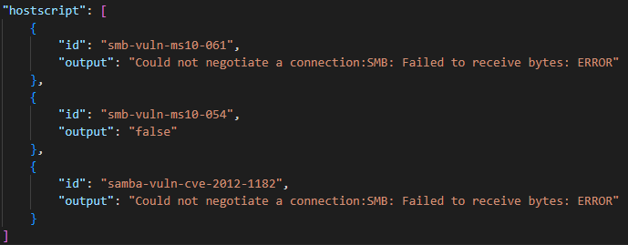

# **[ CyberSentinel ]**


## **Overview**

**[ CyberSentinel ]** is a powerful and versatile penetration testing tool designed for red team operations and ethical hacking. It provides advanced penetration testing simulation capabilities through reverse shell connection.

### **Key Use Cases**
- **Penetration Testing**: Evaluate the security of systems and identify vulnerabilities.


**Disclaimer**: This tool is intended for authorized testing and educational purposes only. Misuse of this tool is strictly prohibited.

---


### **Screenshots**

1. **Dashboard**  
     
   *Caption: Overview of the tool's main dashboard(CLI).*

2. **Scanner**  
     
   *Caption: Scanning for vulnerabilities.*

3. **Captured Data Example**  
     
   *Caption: View of captured vulnerabilities.*

---

## **Installation**

### Prerequisites
- **Operating System**: Linux (Ubuntu/Debian recommended)
- **Dependencies**:
  - Python 3.8+
  - OpenSSL
- **Tools**: Git, Curl

### Steps to Install
1. Clone the repository:
   ```bash
   git clone https://github.com/JoshuaCeleb/CyberSentinel.git/
   ```
2. Navigate to the tool's directory:
   ```bash
   cd CyberSentinel
   ```
3. Install the required dependencies:
   ```bash
   sudo apt-get update
   sudo apt-get install python3 python3-pip nginx openssl
   pip3 install -r requirements.txt
   ```

5. Launch the tool:
   ```bash
   python3 cli.py
   ```

---

## **Usage**

### **Starting the Tool**
1. Run the tool with administrator privileges.
2. Configure your phishing campaign by selecting:
   - Target website template.
   - SSL settings.
   - Data capture options.


## **License**

This project is licensed under the [MIT License].  

---

## **Support**

If you have questions or issues, feel free to:
- Open an issue on [GitHub](https://github.com/JoshuaCeleb/CyberSentinel.git/issues).
- Email us at [support@example.com].